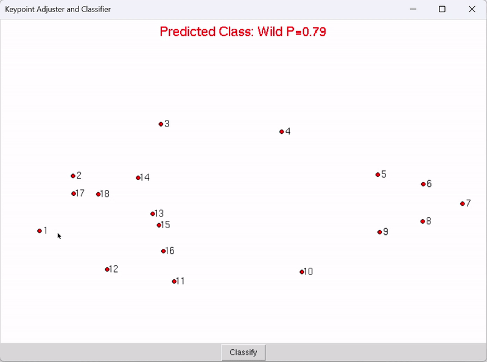

## Environment Setup

1. Create a new conda environment with Python 3.11:
    ```sh
    conda create --name myenv python=3.11
    ```

2. Activate the newly created environment:
    ```sh
    conda activate myenv
    ```

3. Install the required packages using pip:
    ```sh
    pip install -r requirements.txt
    ```

## Data Preparation

1. Download the dataset from the following [link](link).
2. Extract the contents of the downloaded file to the datasets directory.

Dataset structure should look like this:
```
./datasets
├── SPAUR
│   ├── res_1152x768
│   │   ├── train_landmark_configuration.TPS
│   │   ├── test_landmark_configuration.TPS
│   │   ├── val_landmark_configuration.TPS
│   │   ├── train
│   │   │   ├── *.jpg
│   │   ├── test
│   │   │   ├── *.jpg
│   │   ├── val
│   │   │   ├── *.jpg
```

## Evaluation

To evaluate our pretrained model available [here](link), run the following command:
```sh
python train.py --config-file configs/r18_spaur_1152x768.yaml --eval-only --model-weights /path/to/weights.pth OUTPUT_DIR /path/to/output_dir
```
You can modify the evaluation procedure by changing the parameters in the config file. If you would like to save the qualitative results of the evaluation, add the "visualization_evaluator" to the list of evaluators specified in the "EVALUATORS" field of the config and rerun the command.
You can also change the dataset subset to evaluate on by changing the "VAL_SPLIT" parameter in the config file. If you want to enable multi scale evaluation set the "MS_EVAL" parameter to True.

## Training

To train the model, run the following command:
```sh
python train.py --config-file configs/r18_spaur_1152x768.yaml
```

## Demo

You can also run a demo of our model on a single image by running the following command:
```sh
python demo.py --config-file configs/r18_spaur_1152x768.yaml --model-weights /path/to/weights.pth --input-image /path/to/image.jpg
```
The demo will save the visualized results in file "demo_output.jpg" in the current directory, and keypoint coordinates in "demo_output.txt".

## Origin classification playground

We also provide a simple playground app for origin classification. To run it, execute the following command:
```sh
cd cls-playground
python run_playground.py
```
There you can see how the prediction and confidence of logistic regression origin classifier changes by adjusting 
individual keypoints.  

